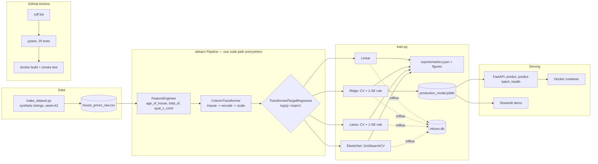

# 🏡 House Price Regression: Linear, Ridge & Lasso — From Multicollinearity to Production

[](.github/workflows/ci.yml)
[](requirements.txt)
[](LICENSE)
[](pyproject.toml)
[](api/main.py)
[](Dockerfile)

A complete, tested, deployable regression project — not just a notebook.
It answers one question in depth: **when does regularization actually
matter, and why?**

The short version: I deliberately engineered multicollinearity into the
feature set (the way it usually happens for real — by accident, via derived
features), proved it with VIF, then measured — not asserted — what Ridge and
Lasso each do about it, including where the textbook story gets more
nuanced than usual.

## Why this project is structured the way it is

- **Synthetic-but-realistic data, by choice, not convenience.** Controlling
  the data-generating process means the *true* coefficients are known —
  including which features have exactly zero true effect. That makes it
  possible to check Lasso's feature-selection claims against ground truth
  instead of taking them on faith. See [`data/DATA_DICTIONARY.md`](data/DATA_DICTIONARY.md).
- **One code path from raw input to prediction, everywhere.** Feature
  engineering lives inside the same `sklearn.Pipeline` that gets saved,
  served by the API, and used by the Streamlit demo. There is no
  reimplementation anywhere, which is exactly what prevents train/serve skew.
- **Every number below is real**, produced by actually running this code,
  not written by hand. Re-run `make train` and you'll get the same ones
  (seeded, reproducible).

## Key results (test set, n=600, held out from all training/tuning)

| Model | Test RMSE | Test MAE | Test R² | Adj. R² | MAPE | Non-zero coefs |
|---|---:|---:|---:|---:|---:|---:|
| Linear (OLS) | $20,035 | $12,308 | 0.8894 | 0.8828 | 3.54% | 34 / 34 |
| **Ridge (1-SE)** ⭐ | $20,153 | $12,703 | 0.8881 | 0.8814 | 3.67% | 34 / 34 |
| Ridge (min CV) | $20,023 | $12,299 | 0.8896 | 0.8829 | 3.53% | 34 / 34 |
| Lasso (1-SE) | $20,609 | $13,063 | 0.8830 | 0.8760 | 3.80% | **23 / 34** |
| Lasso (min CV) | $19,970 | $12,260 | 0.8901 | 0.8835 | 3.53% | 32 / 34 |
| ElasticNet | $19,985 | $12,271 | 0.8900 | 0.8834 | 3.53% | 32 / 34 |

⭐ = production model (Ridge, alpha chosen by the 1-SE rule — see below)

**All six models land within ~3% RMSE of each other.** That's a finding,
not a disappointment: with 2,400 training rows and 34 features (n/p ≈ 70),
OLS is already fairly stable, so regularization's *accuracy* upside here is
modest. Its real value is interpretability (Lasso) and coefficient stability
(Ridge) — both demonstrated directly below, not just asserted. Section 15 of
the notebook shows what happens when n≫p stops being true.

## Visual highlights

**Multicollinearity, proven, not assumed.** Two engineered features
(`age_of_house`, `total_sf`) are redundant with columns already in the
model — `year_built`/`age_of_house` are *exactly* collinear by construction
(VIF = ∞), `total_sf` sits at VIF 18.0:


**The regularization paths** — Ridge shrinks every coefficient toward zero;
Lasso drives many of them to exactly zero:


**Why Ridge helps, shown empirically via 200-iteration bootstrap** (not just
asserted): coefficient variance for a collinear feature falls monotonically
as regularization strength increases, at the cost of bias:


**The payoff: a genuine stress test.** Expand to pairwise feature
interactions and subsample to 250 rows (n/p ≈ 1.6) and unregularized OLS's
cross-validated R² collapses to **-1.21** — worse than predicting the mean —
while Ridge (+0.14) and Lasso (+0.49) stay in usable territory:


More figures (predicted-vs-actual, residual diagnostics, learning curves,
CV curves, feature importance, correlation heatmap) are in
[`reports/figures/`](reports/figures/) and walked through in the notebook.

## The core story: why regularization? (with receipts)

1. **Multicollinearity is introduced on purpose, during feature
   engineering** — `FeatureEngineer` derives `age_of_house` from
   `year_built` and `total_sf` from `gr_liv_area + total_bsmt_sf`. Both are
   reasonable engineering decisions in isolation; together they duplicate
   information already in the model. This mirrors how it usually happens on
   real teams — nobody hand-codes correlated raw inputs, engineers just
   derive redundant features without noticing.
2. **VIF confirms it's real, not cosmetic.** `year_built`/`age_of_house`
   hit infinite VIF (exact linear dependency); `total_sf` (18.0),
   `gr_liv_area` (12.2), and `year_remod` (10.5) show severe-but-finite
   multicollinearity.
3. **A statsmodels OLS fit shows the statistical fingerprint** — the
   collinear pair gets enormous standard errors and p-values near 1, even
   though the model's overall fit is fine. Individual point estimates for
   that pair are statistically meaningless; the model's *predictions* are
   still okay. That distinction — a subtle one — is in the notebook,
   Section 7.
4. **Ridge is chosen via the 1-SE rule** (Hastie/Tibshirani/Friedman, *ESL*
   §7.10), not just the alpha that minimizes CV error: the simplest model
   whose CV score is still within one standard error of the best. Ridge's
   alpha jumps from 1.42 (min CV) to 65.1 (1-SE) — a much more conservative,
   more stable model at a negligible cost in accuracy.
5. **Lasso's feature selection checks out against known ground truth.** At
   its 1-SE alpha, Lasso zeroed 11 of 34 features:
   `age_of_house, bedroom_abvgr, half_bath, house_style_1.5Story,
   house_style_1Story, noise_2, noise_3, qual_x_cond, totrms_abvgrd,
   year_built, year_remod`. Our data-generating process gave `noise_1/2/3`
   and (as it happens) `year_built`/`year_remod` exactly zero true effect on
   price — Lasso correctly zeroed 4 of those 5. It did **not** zero
   `noise_1`; in a finite sample a purely random column isn't perfectly
   uncorrelated with the target by chance, and Lasso is a statistical
   procedure with real error rates, not an oracle. That honesty is the
   point — a portfolio piece that claims "Lasso found the exact truth"
   would be a worse demonstration of understanding than one that shows
   where it doesn't.
6. **Ridge's "grouping effect" is a genuine subtlety, included on
   purpose.** `total_sf`'s own coefficient *grows* with alpha instead of
   shrinking, while its correlated source columns shrink — Ridge pulls
   correlated coefficients toward *each other*, not always toward zero
   individually (`reports/ridge_grouping_effect.csv` has the numbers). The
   bootstrap variance-reduction result still holds; "shrinkage" just
   operates on the correlated group, not coefficient-by-coefficient.

## Architecture



## Project structure

```
house-price-regression/
├── api/                    FastAPI service (main.py, Pydantic schemas.py)
├── app/                    Streamlit interactive demo
├── config/config.yaml      Single source of truth: paths, seeds, CV/alpha settings
├── data/
│   ├── raw/                Generated dataset (reproducible, seed=42)
│   └── DATA_DICTIONARY.md
├── models/                 Saved pipelines (.joblib) — one per model + production_model.joblib
├── notebooks/
│   ├── 01_full_analysis.py     jupytext source (clean git diffs)
│   └── 01_full_analysis.ipynb  executed, real outputs baked in
├── reports/
│   ├── figures/             13 generated plots
│   ├── metrics.json          full results, machine-readable
│   └── *.csv                 VIF table, model comparison, grouping-effect evidence
├── src/
│   ├── data/make_dataset.py       synthetic data generator, documented DGP
│   ├── features/build_features.py FeatureEngineer + preprocessing pipeline
│   ├── models/train.py            CV alpha search, 1-SE rule, final fit, MLflow logging
│   ├── models/predict.py          single inference entry point (API + Streamlit share it)
│   └── visualization/visualize.py all plotting functions
├── tests/                   25 tests: data, features, training logic, API
├── .github/workflows/ci.yml lint -> train -> test -> docker build+smoke test
├── Dockerfile / docker-compose.yml
└── Makefile                 make data / train / test / api / app / docker-build
```

## Quickstart

```bash
git clone <this-repo> && cd house-price-regression
python -m venv .venv && source .venv/bin/activate
make install

make train        # generates data + trains all models + all figures (~60s)
make test          # 25 tests
make api            # FastAPI on :8000  ->  /docs for interactive Swagger UI
make app            # Streamlit demo on :8501
make docker-run    # containerized API via docker-compose
make mlflow-ui       # inspect experiment runs at :5000
```

## API usage

```bash
curl -X POST http://localhost:8000/predict \
  -H "Content-Type: application/json" \
  -d '{
    "lot_area": 8500, "gr_liv_area": 1950, "total_bsmt_sf": 1000,
    "garage_area": 480, "year_built": 2005, "year_remod": 2015,
    "overall_qual": 7, "overall_cond": 6, "full_bath": 2, "half_bath": 1,
    "bedroom_abvgr": 3, "totrms_abvgrd": 7, "fireplaces": 1,
    "distance_to_downtown_km": 5.2, "school_rating": 8, "crime_index": 22.0,
    "median_income_area": 78.0, "has_pool": false,
    "neighborhood": "Lakeside", "house_style": "2Story"
  }'
# -> {"predicted_price": 428391.5, "predicted_price_formatted": "$428,392", "model_used": "Ridge (1-SE)"}
```

Four fields — `total_bsmt_sf`, `garage_area`, `school_rating`, `crime_index`
— are optional in the schema, deliberately mirroring the four columns the
training data has missing-at-random values in; omit them and the pipeline's
learned imputation fills them in, exactly as it does at training time.
`GET /health`, `GET /model-info`, and `POST /predict-batch` round out the
service; full interactive docs at `/docs` (Swagger) once running.

## Testing & CI

25 tests across 4 files: dataset generation (reproducibility, no leakage of
missingness into the wrong columns), feature engineering (unseen categories
handled gracefully, no NaNs survive the pipeline), training logic (the 1-SE
rule is unit-tested against hand-constructed CV curves, not just eyeballed),
and the API (validation errors, optional-field handling, batch predictions).
CI (`.github/workflows/ci.yml`) runs on Python 3.11 and 3.12: lint → generate
data → train → test → build the Docker image → smoke-test the running
container's `/health` endpoint.

## Design decisions worth asking me about in an interview

- **Why cross-validate the *whole* pipeline, not just the model?** Because
  fitting the imputer/encoder/scaler before splitting leaks validation-fold
  statistics into training. `make_search_pipeline` re-fits feature
  engineering and preprocessing inside every CV fold.
- **Why `TransformedTargetRegressor` instead of manually calling
  `np.log1p`/`np.expm1`?** So every caller — API, tests, Streamlit, future
  batch jobs — gets dollar-scale predictions automatically, with the
  inverse-transform impossible to forget.
- **Why the 1-SE rule instead of just the best CV alpha?** A simpler,
  more-regularized model that's statistically indistinguishable in CV
  performance is preferable in production — more stable, more robust to
  distribution shift, cheaper to explain to stakeholders.
- **Why does the stress test subsample to n=250 instead of using the full
  2,400 rows?** Because at 2,400 rows the interaction-expanded feature set
  still has a comfortable n/p ≈ 15.7, and OLS doesn't actually break down
  there (verified — not asserted; see the notebook for the milder result I
  got first and why I changed the experiment rather than the narrative).
- **Why synthetic data at all?** It's the only way to check a feature
  selection or coefficient-recovery claim against ground truth. The
  trade-off — and I'd say this unprompted — is that it can't tell you
  whether the *functional form* (mostly linear, one small interaction term)
  matches reality. Swapping in real MLS data and re-validating every claim
  above is future work, not an afterthought.

## Tech stack

pandas · numpy · scikit-learn · statsmodels · matplotlib/seaborn · FastAPI ·
Pydantic · Docker · GitHub Actions · MLflow · Streamlit · pytest · ruff ·
Jupyter/jupytext

## Future work

- Non-linear benchmark: Random Forest / Gradient Boosting + SHAP, to
  quantify how much the "mostly linear" assumption costs.
- Robust regression (Huber/RANSAC) — the residual Q-Q plot's tail traces
  directly back to the outlier sales injected during data generation.
- Bayesian regression for full posterior predictive uncertainty, not just
  point estimates.
- Optuna-based hyperparameter search in place of a fixed grid.
- Swap in a real listings dataset and re-validate every claim above against
  it, not just the synthetic one.

## License

MIT — see [LICENSE](LICENSE).
